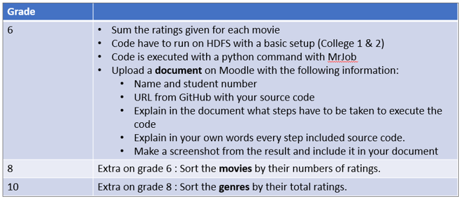
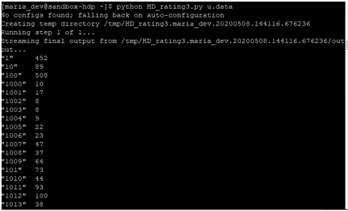
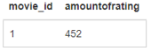
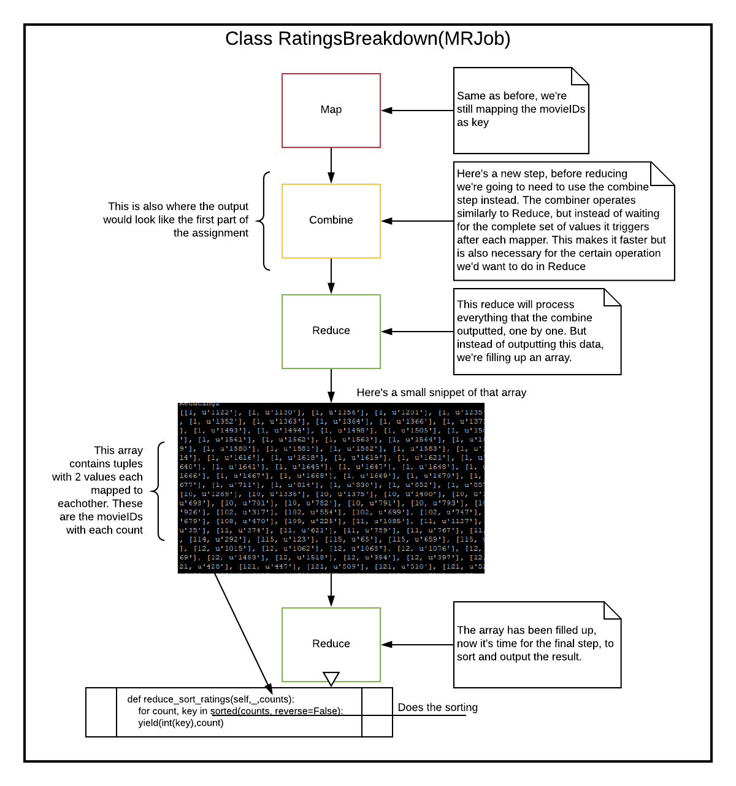
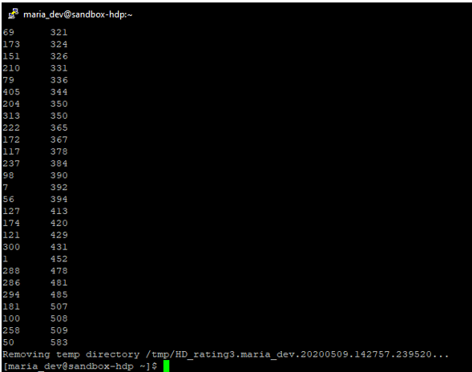
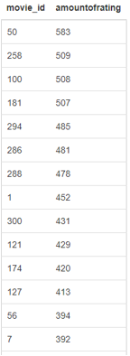

# HDP_Assignment
#### Assignment for using HDP Map Reduce 

Starting off this assignment I had a look at the requirements

The code we initially got for free almost completes the first part of the assignment.

    from mrjob.job import MRJob
    from mrjob.step import MRStep

    class RatingsBreakdown (MRJob):

      def steps(self):
          return [
              MRStep(mapper=self.mapper_get_ratings,
                     reducer=self.reducer_count_ratings)
          ]

      def mapper_get_ratings(self, _, line):
          (userID, movieID, rating, timestamp) = line.split('\t')
          yield rating, 1

      def reducer_count_ratings (self, key, values):
          yield key, sum(values)

    if __name__ == '__main__':
        RatingsBreakdown.run()

But to be able to utilize this we must first understand what is happening, this is what I came up with after some research and debugging.

What is happening in this code snippet is that there’s 3 functions that are bootstrapped into HDP using MrJob. What MrJob will do is pretty much convert this piece of code into a job. When this class is run RatingsBreakdown.run()by MrJob, it’ll eventually call the def steps(self): function. This function returns a reference, much looking like a delegate(C# thing) of in this case, what is the mapper, and what is the reducer. HDP will then know what to do when mapping and what to do once all that mapping is finished and it’s time to reduce. 

    def mapper_get_ratings(self, _, line):
    
This function simply says, get me all the movies, and name each column this. What we then yield is the data we want to work with, in this case rating and 1, its key-value-pair. 
Once all this data is mapped, it’ll send it to the reduce function 

    def reducer_count_ratings (self, key, values):

This function is doing the real work, taking all the data mapped and presenting it the way we want it, summing up the amount of ratings for each rating. That data comes to this function through the “values” in the function parameters.

Due to a typo, apparently the assignment wanted the Count of ratings instead of a Sum. So lets get the count of ratings for each movieID. What I noticed here is that the job written above, what it actually does is just counting the duplicates of each key. So what I did to get the count of each movieID, I simply took the above script and replaced ratings with movieID.

 
Just to confirm the results I wrote this quick sql query that gets the count of rating from movieID==1

    select movie_id, COUNT(rating) as `amountOfRating` from ratings where movie_id ==1 group by movie_id;

 
And indeed, the solution was correct.

## For grade 8
But the movies weren’t sorted, that’s not too nice, lets fix it! After some research, here’s an idea:

Let’s turn that idea into reality!

    from mrjob.job import MRJob
    from mrjob.step import MRStep

    class RatingsBreakdown (MRJob):
          def steps(self):
              return [
                  MRStep(mapper=self.mapper_get_ratings,
                         combiner=self.combine_movie_ratings,
                         reducer=self.reducer_count_ratings),
                  MRStep(reducer=self.reduce_sort_ratings)
              ]

          def mapper_get_ratings(self, _, line):
              (userID, movieID, rating, timestamp) = line.split('\t')
              yield movieID, 1

          def combine_movie_ratings(self, key, counts):
              yield key, sum(counts)

          def reducer_count_ratings (self, key, values):
              yield None, (sum(values),key)

          def reduce_sort_ratings(self,_,counts):
              for count, key in sorted(counts, reverse=False):
                      yield(int(key),count)

    if __name__ == '__main__':
        RatingsBreakdown.run()

 
To make sure it’s correct, lets check with a quick query
    select movie_id, COUNT(rating) as `amountOfRating` from ratings group by movie_id order by amountOfRating DESC;

 

The output from this query matches the output from our job.😊
